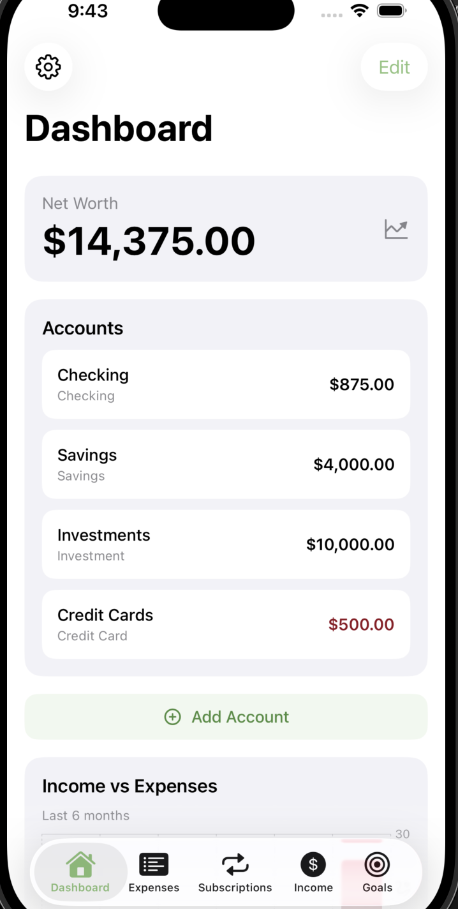
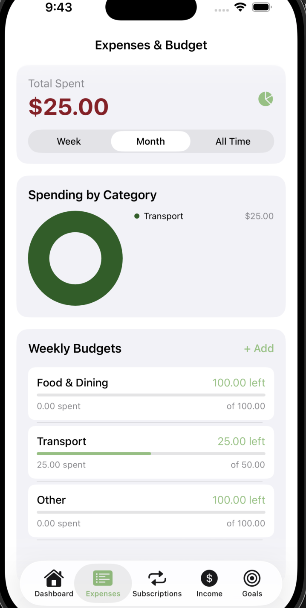
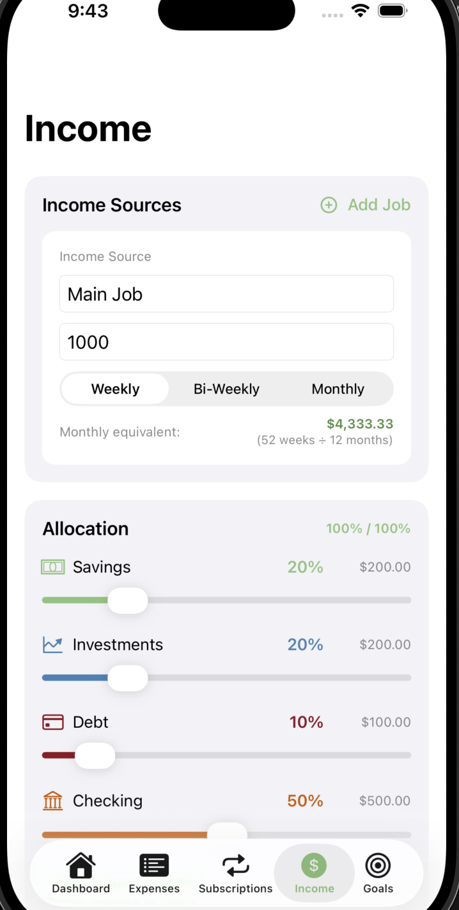
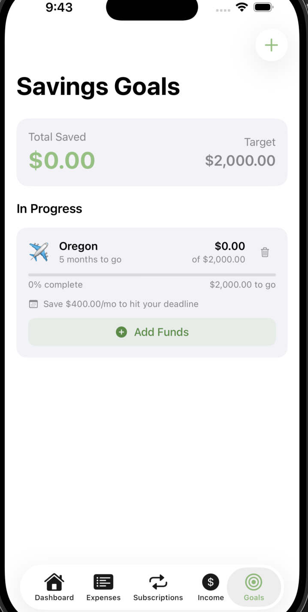
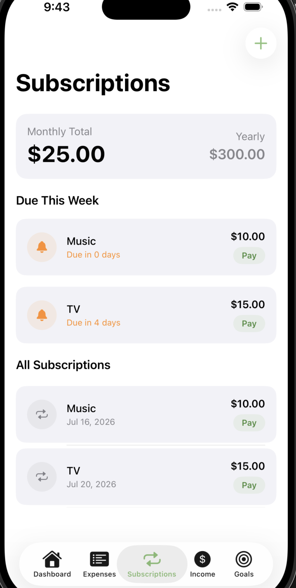

# Bilanoe Budget App

Bilanoe is a personal finance iOS application built with SwiftUI that helps users manage their money through budgeting, expense tracking, income management, subscriptions, and savings goals.

## Overview

Bilanoe was designed to provide a simple and intuitive way for users to understand their finances. The app combines budgeting tools, account tracking, and financial insights into one cohesive experience.

## Features

### Authentication
- Username/password sign up and login
- Sign in with Apple
- Secure user sessions using Keychain

### Onboarding
- Custom 3-page onboarding experience
- Personalized logo branding
- First-launch setup flow

### Dashboard
- Account cards for:
  - Checking
  - Savings
  - Credit cards
  - Investments
- Add, edit, and delete accounts
- Net worth calculation and history tracking
- Income vs. expense visualization
- Spending streak tracking
- Budget progress overview

### Expenses & Budgets
- Log expenses with:
  - Category
  - Amount
  - Date
  - Account
  - Notes
- Weekly and monthly budget modes
- Category-based budget tracking
- Over-budget warnings
- Spending trend charts
- Category donut charts
- Automatic balance updates when expenses are deleted

### Subscriptions
- Track recurring subscriptions
- Billing cycle management
- Overdue subscription alerts
- Mark subscriptions as paid
- Account balance deductions and refunds

### Income Management
- Support for multiple income sources
- Weekly, bi-weekly, and monthly income schedules
- Percentage-based income allocation:
  - Savings
  - Investments
  - Debt
  - Checking
- Ability to undo previous distributions

### Savings Goals
- Create custom savings goals
- Emoji-based goal customization
- Target amounts and deadlines
- Add or remove funds
- Progress tracking
- Monthly contribution suggestions
- Goal completion celebrations

### Settings
- Budget mode customization
- Default account selection
- Haptic feedback controls
- System dark/light mode support
- Share Bilanoe
- Clear application data

## Design

- Built with SwiftUI
- Custom branding and logo system
- Pistachio green accent theme
- Wine red expense/debt indicators
- Dark mode support
- Haptic feedback throughout the app
- Custom empty states
- Notification support for overdue subscriptions

## Screenshots

### Dashboard

### Expenses

### Income

### Savings Goals

### Subscriptions

## Technologies Used

- Swift
- SwiftUI
- SwiftData
- Keychain Services
- Xcode
- Git & GitHub

## Future Improvements

- Cloud synchronization
- More advanced financial analytics
- Additional customization options
- Widgets and Apple Watch support

## Project Status

Currently in active development.
